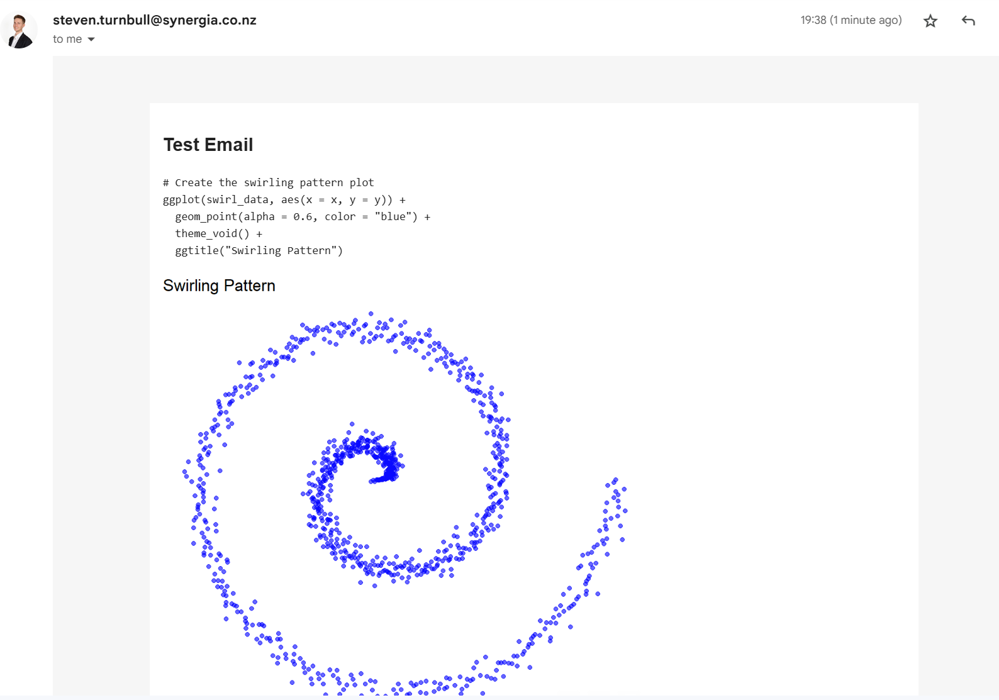
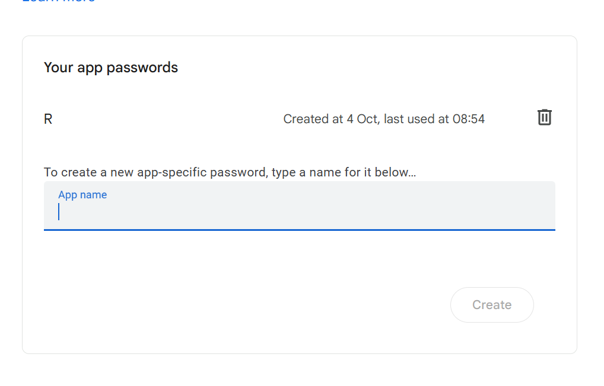
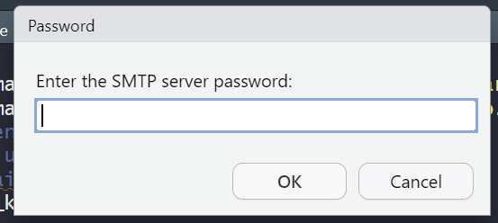

# Intro

Have you ever thought about sending an email directly from R? Me neither, until now. It turns out it's actually quite easy, and knowing how to do this opens up many opportunities to reduce faff (this is a technical term), automate processes, and apply custom styling to make emails looks nice.

In this short post, I'll show you how you can send an email in R using the [`blastula`](https://rstudio.github.io/blastula/articles/blastula.html) library, harnessing the power of [`Quarto`](https://quarto.org/) for setting up the email contents.

This is what we will end up with, our analysis straight from R and into our inbox! 

# Setting up your email template using quarto

First, we'll need to have a quarto document at hand with the contents that we want to send. I've made something random below. Note the key difference is the inclusion of `output: blastula::blastula_email` in the `YAML` header. Everything else is pretty standard R quarto/markdown code.

```{r, eval = FALSE, echo=F}
library(dplyr)
library(gmailr)
library(stringr)
library(dplyr)
library(htmltools)
```

```{r eval = F}
#---
#title: "test_quarto"
#format: html
#editor: visual
#output: blastula::blastula_email
#---

## Test Email

#```{r, echo = F}
#library(ggplot2)
#library(dplyr)
#```

#```{r, echo=F}
# Generate fake data for swirling pattern
#set.seed(123)
#n_points <- 1000
#theta <- seq(0, 4 * pi, length.out = n_points)
#r <- seq(0, 10, length.out = n_points) + rnorm(n_points, sd = 0.3)

#swirl_data <- tibble(
#  x = r * cos(theta),
#  y = r * sin(theta)
#)
#```

#```{r}
# Create the swirling pattern plot
#ggplot(swirl_data, aes(x = x, y = y)) +
#  geom_point(alpha = 0.6, color = "blue") +
#  theme_void() +
#  ggtitle("Swirling Pattern")
#```
```

In this pretty standard quarto document, I load in my libraries, make some random data of a swirling pattern, and visualise it. Quarto is a really powerful tool for presenting data and making reports, what I have shown above does not scratch the surface ([the website you are reading this on was built using quarto](https://quarto.org/docs/websites/)).

What if we wanted to email this through to someone? We could render the quarto doc, open our gmail and attach it as html, a pdf, or a word doc. But it turns out we can just send it straight from R, cutting out a bunch of steps. Better yet, we can directly embed our analysis in the email itself - no attachments need. This means the person recieving it doesn't need to open up any additional files.

# Send your Email using `blastula`

[`blastula`](https://rstudio.github.io/blastula/articles/blastula.html) is an R library that allows us to create and send HTML email messages from R. There are a few different functions that can be used to do this, but we'll keep it simple. We want to render our quarto doc and send that as the email contents. To do this, we will make use of the `render_email()` function. The only thing we need to pass in is the location of our quarto doc.

```{r, eval = F}
# Load the blastula package
library(blastula)
library(keyring)
library(ggplot2)
library(dplyr)

# Create the email body 
email <- render_email('C:/code/automated_emails/email_summary.Qmd')
```

Now we have our email contents sorted, we need to send it. To do this, we will need to set up our creditials so we can send the email directly from R using Simple Mail Transfer Protocol (SMTP). We will need to set up an App Password in gmail to allow R to connect to our Gmail account (see this [guide](https://support.google.com/accounts/answer/185833?hl=en). It's pretty straight forward, but you will need to ensure that you have 2-factor authentication set up on your account. Create your app password by clicking on [this link](https://myaccount.google.com/apppasswords), logging in, and then create a new password - do not forget the password that is generated, store it somewhere safe.



Once that is done, we can store our credentials and SMTP Configuration following the [blastula guidelines here](https://pkgs.rstudio.com/blastula/articles/sending_using_smtp.html). We just need to run the `create_smtp_creds_key()` function as I have done below.

```{r, eval=F}
# Store SMTP credentials in the
# system's key-value store with
# `provider = "gmail"`
 create_smtp_creds_key(
   id = "gmail",
   user = "your@email.com",
   provider = "gmail",
   overwrite = T
)
```

When executing this function, there will always be a prompt for the password, where you will need to put your associated app password.  Following this, we just need to send our email! Fill out the from and to arguments, add a subject, and link to our newly created creditials key.

```{r, eval = F}
smtp_send(
  email,
  from = "your@email.com",
  to = c(
    "your@email.com"
    ,"person2@email.com"
    ,"person3@email.com"
  ),
  subject = paste0("Test Email - ", Sys.Date()),
  credentials = creds_key(id = "gmail")
)
```

And there we have it, our analysis straight from R and into our inbox! While this is a pretty simple use case, and may not be entirely necessary, there is a great deal more you can achieve from knowing how to automate emails from R. What use cases can you think of? 