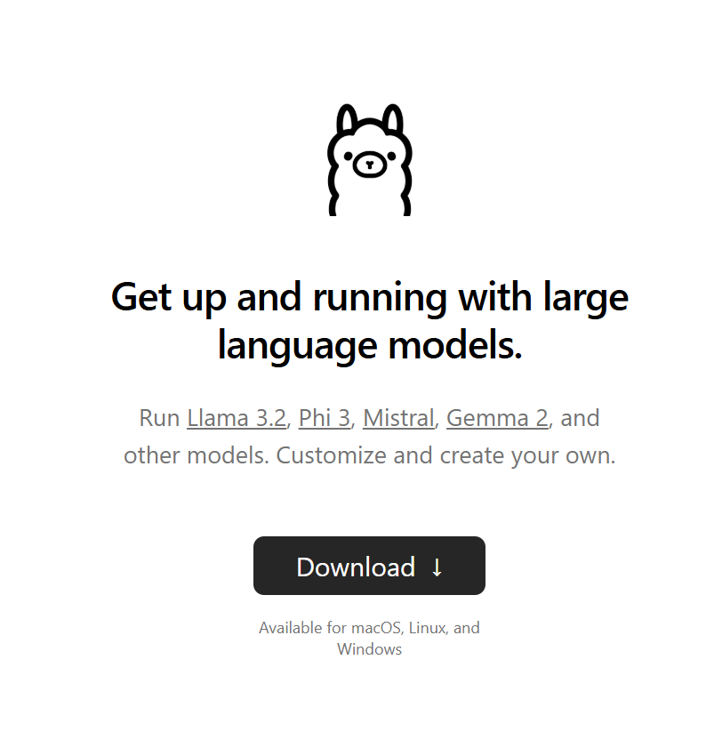
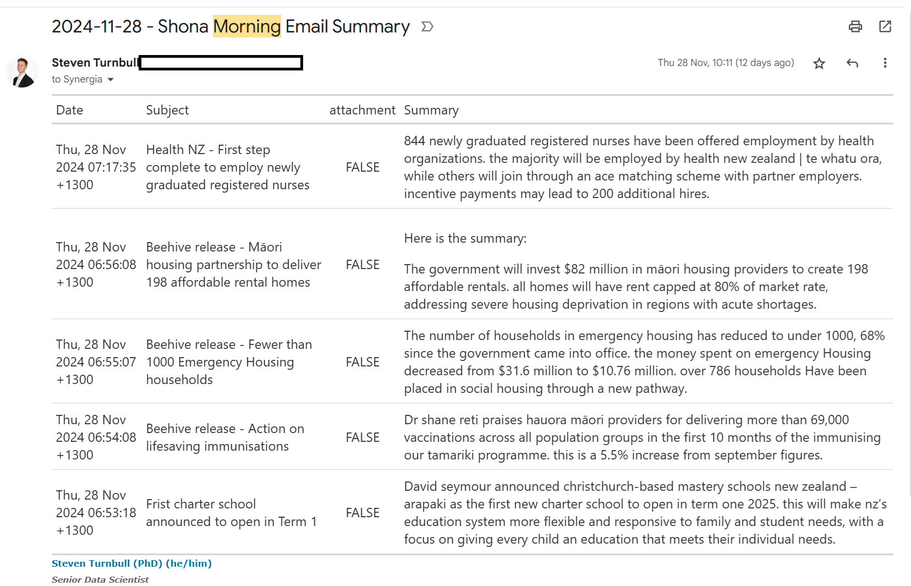

# Intro

One of my jobs over the last few months has been to identify good use cases for AI in the midst of the boom/bubble in application. There have been a couple of common issues that have come up:

-   Services cost money

-   You often need to trust someone else with your data

Both of these issues can be a dealbreaker, especially if your data is sensitive in any way. **Luckily, there are ways to carry out tasks in an automated way that will not cost you any money, and will not send your data anywhere**. Enter `Ollama`. `Ollama` is [a lightweight, extensible framework for building and running language models on your local machine](https://github.com/ollama/ollama). Everything is free and open source! You do not need to pay for a service. The LLM runs on your local machine, which means your sensitive data is protected.

This in and of itself is a really powerful tool to know about. It may not operate at quite the same level as external models, but the functionality is definitely serviceable for most use cases and improvements in speed and responses are noticeable compared to a short time ago.

In this post, I will show you one direct application of `Ollama` that will be immediately beneficial. Using the `Mall` package in R will allow us to directly interact with the local LLM and use it to wrangle and summarise data. I will show you how you can use the `Mall` library to summarise sensitive data (in this case, my emails!), and then automatically email the summary through to me (following a method detailed in my [previous post](https://sturbull.github.io./posts/automation/automated_emails_from_R.html "Sending Emails from R")).

# Using the `Mall` library with Llama3.2

## Download and install Llama3.2

Head to <https://ollama.com/> to download `ollama`. You will be greeted by this



Once downloaded, all you will need to do is go to your command terminal and run:

```         
ollama run llama3.2
```

This will run the LLM llama3.2, and you can chat with it directly in your terminal! Once this is up and running, we can work on the next step of our project, interacting with the LLM in R.

::: callout-note
## As detailed on the ollama website, you should have at least 8 GB of RAM available to run the 7B models, 16 GB to run the 13B models, and 32 GB to run the 33B models.
:::

## Using the `Mall` library to summarise text

[`Mall`](https://mlverse.github.io/mall/) is an R library that allows us to run LLMs against a data frame in R. You can use it to run sentiment analysis, extract key information, and classify text. In our case, we are going to make use of the `llm_summarize` function, which will take a column of unstructured data and provide a summary of *n* number of words for each row of data.

The code below will summarise the data based on a column in our data (e.g. Review). We can choose the number of words in the summary, and it will return an additional column (defaults to the column name `.summary`) containing our summary.

```{r, eval=F, message=FALSE, warning=FALSE}
library(mall)
df_summarised <- mall::reviews |>
  llm_summarize(review, max_words = 5)

```

The `mall` package is super useful. We can quickly get an AI summary of our data, and by using `ollama`, our data isn't being sent anywhere. By integrating ollama with R, we are also able to engage in programatic prompt, cycling through a data.frame of information.

In my final example, I'll show you how you can quickly leverage these functions to build an incredibly useful tool: and AI-powered email summariser.

# Connecting `R` with Gmail using the `gmailr` library

Our very first job will be to get a corpus of data that we can run our LLM against. By using the `gmailr` library, we can connect to gmail and read emails in R.

To connect to the gmail API via `gmailr`, you will need to set up an 0Auth client. This can be a bit fiddly, but [this guide](https://gmailr.r-lib.org/dev/articles/oauth-client.html) will walk you through the process. Once this is done, and you have the `credentials` .json file, we can store the gmailr 0Auth client in an REnviron file. This file is where we can store secrets, the information we will use to connect to our gmail, but do not want to include directly in our code.

```         
GMAILR_OAUTH_CLIENT=/path/to/my/gmailr/oauth-client.json
```

# Setting up your email template using quarto

```{r, eval = FALSE}
## `r paste0(Sys.Date()," - Morning Email Summary")`

library(dplyr)
library(gmailr)
library(stringr)
library(dplyr)
library(mall)
library(htmltools)
library(gt)

# Authenticate
readRenviron("C:/code/automated_emails/.Renviron")

GMAILR_OAUTH_CLIENT <- Sys.getenv("GMAILR_OAUTH_CLIENT")

gm_auth_configure(path = GMAILR_OAUTH_CLIENT)
# Get today's date in the required format
today <- Sys.Date()
formatted_date <- format(today, "%d %b %Y")

# Search for emails from the sender and from today
emails <- gm_messages(search = paste0("from:someones@email.com"),num_results = 10)

email_list <- emails[[1]]$messages
email_contents_df <- data.frame()
index <- 1
for(i in 1:length(email_list)){
  #cat("\nScanning email ",i," of ",length(email_list))
  msg <- gm_message(email_list[[i]]$id)
  date <- gm_date(msg)
  formatted_date <- str_replace_all(format(today, "%d %b %Y"),"^0","")
  if(str_detect(pattern = formatted_date, string = date) &  length(gm_body(msg))>0){
    #make data frame of email contents
    email_df <- data.frame(
      date = gm_date(msg),
      subject = gm_subject(msg),
      body = gm_body(msg)[[1]][1]
    )
    email_contents_df <- bind_rows(email_contents_df,email_df)
  }
}

mall::llm_use(backend = "ollama",model = "llama3.2")

if(nrow(email_contents_df) == 0){
  gt_table <- "🙁 No morning emails today 🙁"
}

summary_df <- email_contents_df |>
  mall::llm_summarize(col = body,
                      max_words = 50)

gt_table <- summary_df |>
  select(-body) |>
  rename(
    Date = date,
    Subject = subject,
    Summary = .summary
  ) |>
  mutate(Summary = str_to_sentence(Summary)) |>
  gt() |>
  gt::as_raw_html()

print(gt_table)
```

The code above is doing a few things.

Firstly, it reads our Renviron file and configures our authentication with `gmailr`. This allows us to connect to the gmail API and read our emails.

Next, I get a list of emails from a particular user, and from a today's date. This is the corpus of emails I'm interested in summarising, but you could do any search that you are interested in. Looking for emails with specific text in a subject is another example.

Once we have that list, I go through each email individually, and carry out the following:

1.  Scan the email, get the ID

2.  Get the date of the email, in the correct format.

3.  If the date is today, and the email has a body, record the email contents

4.  bind the email info to a main data.frame.

Once we have the data.frame with all of our information, we can run the `mall` function `llm_summarise` to get a 50 word summary of each email.

I then use the `gt` library to get a tidy table of the emails. The function `gt::as_raw_html()` will embed the table within the email we send.

::: callout-tip
## You can update this code to read email attachments. Use the trinker library textreadr, and the function read_document() will be able to read both word and pdf documents.
:::

# Send your Email using `blastula`

In my [previous post](https://sturbull.github.io./posts/automation/automated_emails_from_R.html "Send emails from R"), I showed how to send emails from R using the `blastula` library. That post covers the basic set up you need for sending emails. Once that's done, we are able to run the following code to send our final email summary.

The `render_email()` function will render a quarto document containing the code outlined above. Once rendered, the next lines of code will send the email off!

```{r, eval = F}
# Load the blastula package
library(blastula)
library(ggplot2)
library(dplyr)

# Create the email body 
email <- render_email('C:/code/automated_emails/email_summary.Qmd')

# Store SMTP credentials in the
# system's key-value store with
# `provider = "gmail"`
 create_smtp_creds_key(
   id = "gmail",
   user = "your@email.com",
   provider = "gmail",
   overwrite = T
)

smtp_send(
  email,
  from = "your@email.com",
  to = c(
    "your@email.com"
    ,"person2@email.com"
    ,"person3@email.com"
  ),
  subject = paste0("Morning Email Summary - ", Sys.Date()),
  credentials = creds_key(id = "gmail")
)
```

Here's an example of an email I get through each day, providing a summary of my morning emails. Instead of having to check through 5 different emails, I get a quick summary in one.



::: callout-caution
## Always verify what your summary is telling you. This should always be the case when working with generative AI, but especially Local LLMs which are not as powerful and are prone to mistakes.
:::

And there we have it, a free AI summary of our emails, that keeps our data local and secure!